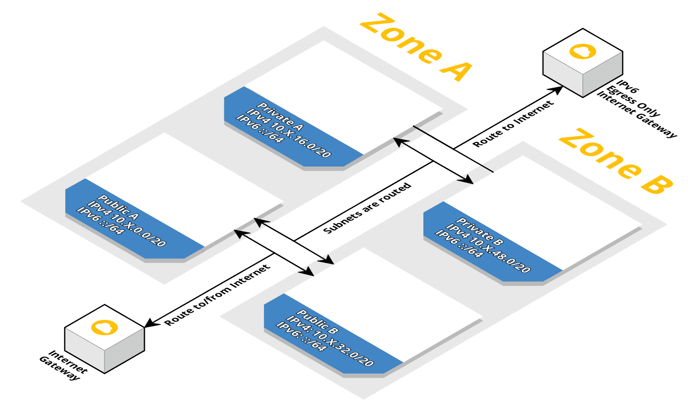
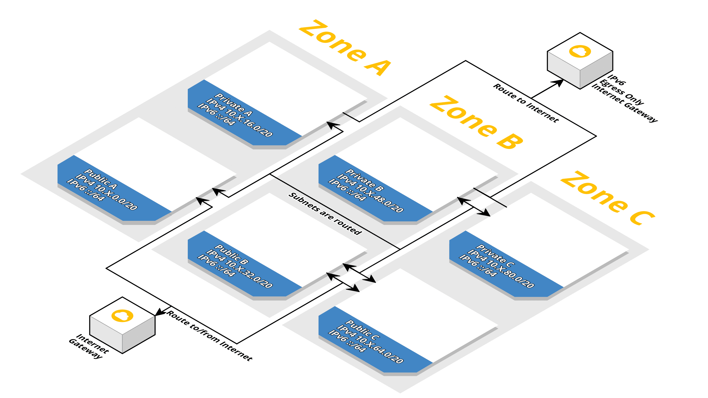
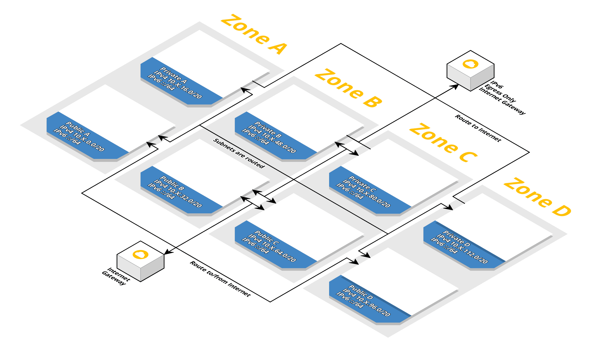

<iframe src="https://ghbtns.com/github-btn.html?user=widdix&repo=aws-cf-templates&type=star&count=true&size=large" frameborder="0" scrolling="0" width="160px" height="30px"></iframe>

> **New**: [Become a sponsor](https://github.com/sponsors/widdix) via GitHub Sponsors!

A VPC is a virtual network inside AWS where you can isolate your workload. A VPC consists of several subnets. Each subnet is bound to an Availability Zone. A **public** subnet has a direct route to/from the Internet. As long as your EC2 instances have an public IPv4 address (default) or IPv6 address, they can communicate (in and out) with the Internet. A **private** subnet does not have a IPv4 route to/from the Internet but an Ipv6 route to the Internet exists. Instances in private subnets can not be accessed from the public Internet. If you want to access the Internet from a private subnetyou need to create a NAT gateway/instance or assign an IPv6 address. You can deploy a bastion host/instance to reduce the attack surface of internal applications.

# VPC with private and public subnets in two Availability Zones
This template describes a VPC with two private and two public subnets.

## Installation Guide
1. 
1. Click **Next** to proceed with the next step of the wizard.
1. Specify a name and all parameters for the stack.
1. Click **Next** to proceed with the next step of the wizard.
1. Click **Next** to skip the **Options** step of the wizard.
1. Click **Create** to start the creation of the stack.
1. Wait until the stack reaches the state **CREATE_COMPLETE**

If you have an existing VPC you can wrap it into our required form using a legacy VPC wrapper: 

# VPC with private and public subnets in three Availability Zones
This template describes a VPC with three private and three public subnets.

## Installation Guide
1. 
1. Click **Next** to proceed with the next step of the wizard.
1. Specify a name and all parameters for the stack.
1. Click **Next** to proceed with the next step of the wizard.
1. Click **Next** to skip the **Options** step of the wizard.
1. Click **Create** to start the creation of the stack.
1. Wait until the stack reaches the state **CREATE_COMPLETE**

If you have an existing VPC you can wrap it into our required form using a legacy VPC wrapper: 

# VPC with private and public subnets in four Availability Zones
This template describes a VPC with four private and four public subnets.

## Installation Guide
1. 
1. Click **Next** to proceed with the next step of the wizard.
1. Specify a name and all parameters for the stack.
1. Click **Next** to proceed with the next step of the wizard.
1. Click **Next** to skip the **Options** step of the wizard.
1. Click **Create** to start the creation of the stack.
1. Wait until the stack reaches the state **CREATE_COMPLETE**

If you have an existing VPC you can wrap it into our required form using a legacy VPC wrapper: 

# NAT Gateway
This template describes a NAT Gateway that forwards HTTP, HTTPS and NTP traffic from a single private subnet to the Internet. You need one stack per availability zone. Example: If you use the `vpc-2azs.yaml` template, you will need two Nat Gateway stack in `A` and `B`.

> You need one Gateway in each `SubnetZone` (e.g. `A` and `B` in `vpc-2azs.yaml`).

## Installation Guide
1. This templates depends on one of our `vpc-*azs.yaml` templates. 
1. 
1. Click **Next** to proceed with the next step of the wizard.
1. Specify a name and all parameters for the stack.
1. Click **Next** to proceed with the next step of the wizard.
1. Click **Next** to skip the **Options** step of the wizard.
1. Click **Create** to start the creation of the stack.
1. Wait until the stack reaches the state **CREATE_COMPLETE**

## Dependencies
* `vpc/vpc-*azs.yaml` (**required**)
* `operations/alert.yaml` (recommended)

# NAT instance
This template describes a **highly available** Network Address Translation (NAT) instance that forwards HTTP, HTTPS and NTP traffic from a single private subnet to the Internet. You need one stack per availability zone. Example: If you use the `vpc-2azs.yaml` template, you will need two Nat Gateway stack in `A` and `B`.

> You need one Instance in each `SubnetZone` (e.g. `A` and `B` in `vpc-2azs.yaml`).

## Installation Guide
1. This templates depends on one of our `vpc-*azs.yaml` templates. 
1. 
1. Click **Next** to proceed with the next step of the wizard.
1. Specify a name and all parameters for the stack.
1. Click **Next** to proceed with the next step of the wizard.
1. Click **Next** to skip the **Options** step of the wizard.
1. Check the **I acknowledge that this template might cause AWS CloudFormation to create IAM resources.** checkbox.
1. Click **Create** to start the creation of the stack.
1. Wait until the stack reaches the state **CREATE_COMPLETE**

## Dependencies
* `vpc/vpc-*azs.yaml` (**required**)
* `vpc/vpc-*-bastion.yaml` (recommended)
* `operations/alert.yaml` (recommended)

# SSH bastion host/instance
This template describes a **highly available** SSH bastion host/instance. SSH Port 22 is open to the world.

**Users must not be able to become root on the bastion host/instance! That's very important for security. Why? SSH places a SSH_AUTH_SOCK file into the /tmp directoy only accessible by the user. If you have root you could use any of those files and jump to other machines as another user!**

## Single user: ec2-user

Specify the same `KeyName` parameter for the bastion host and all other stacks you want to connect to.

Use `ssh -J ec2-user@$bastion ec2-user@$target` and replace `$bastion` with the `IPAddress` output of the stack; `$target` with the private IP address of the EC2 instance you want to connect to.

## Personalized users

Enable the `IAMUserSSHAccess` parameter for the bastion host and all other stack you want to connect to.

Use `ssh -J $user@$bastion $target` and replace `$user` with your IAM user name; `$bastion` with the `IPAddress` output of the stack; `$target` with the private IP address of the EC2 instance you want to connect to.

## Installation Guide
1. This templates depends on one of our `vpc-*azs.yaml` templates. 
1. 
1. Click **Next** to proceed with the next step of the wizard.
1. Specify a name and all parameters for the stack.
1. Click **Next** to proceed with the next step of the wizard.
1. Click **Next** to skip the **Options** step of the wizard.
1. Check the **I acknowledge that this template might cause AWS CloudFormation to create IAM resources.** checkbox.
1. Click **Create** to start the creation of the stack.
1. Wait until the stack reaches the state **CREATE_COMPLETE**

## Dependencies
* `vpc/vpc-*azs.yaml` (**required**)
* `operations/alert.yaml` (recommended)
* `vpc/zone-*.yaml`

## Limitations
* Only one EC2 instance is managed by the ASG. In case of an outage the instance will be replaced within 5 minutes.

# VPN bastion host/instance
This template describes a **highly available** VPN bastion host/instance based on the [SoftEther VPN Project](https://www.softether.org).

## Installation Guide
1. This templates depends on one of our `vpc-*azs.yaml` templates. 
1. 
1. Click **Next** to proceed with the next step of the wizard.
1. Specify a name and all parameters for the stack.
1. Click **Next** to proceed with the next step of the wizard.
1. Click **Next** to skip the **Options** step of the wizard.
1. Check the **I acknowledge that this template might cause AWS CloudFormation to create IAM resources.** checkbox.
1. Click **Create** to start the creation of the stack.
1. Wait until the stack reaches the state **CREATE_COMPLETE**

## Administration guide
During installation, the [pre shared key](https://en.wikipedia.org/wiki/Pre-shared_key) (`VPNPSK` parameter), and the admin password (`VPNAdminPassword` parameter) are set. A first VPN user is also created (`VPNUserName`, and `VPNUserPassword` parameters). To add further users or make further changes to the configuration you have to configure SoftEther VPN Server.

### Windows

1. Download and install [SoftEther VPN Server and VPN Bridge (Ver 4.29, Build 9680, rtm)](http://www.softether-download.com/files/softether/v4.29-9680-rtm-2019.02.28-tree/Windows/SoftEther_VPN_Server_and_VPN_Bridge/softether-vpnserver_vpnbridge-v4.29-9680-rtm-2019.02.28-windows-x86_x64-intel.exe)
    1. Select the component `SoftEther VPN Server Manager (Admin Tools Only)`
1. Add a new setting
1. Set host name to
    1. the domain name (if `ParentZoneStack` parameter was set)
    1. the `IPAddress` output of the stack
1. Set the password to the admin password (`VPNAdminPassword` parameter)
1. Save with OK button
1. Select newly created setting and click the connect button

### MacOS

1. Download and install the [SoftEther VPN Server Manager for Mac OS X (Ver 4.21, Build 9613, beta)](http://www.softether-download.com/files/softether/v4.21-9613-beta-2016.04.24-tree/Mac_OS_X/Admin_Tools/VPN_Server_Manager_Package/softether-vpnserver_manager-v4.21-9613-beta-2016.04.24-macos-x86-32bit.pkg)
1. Add a new setting
1. Set host name to
    1. the domain name (if `ParentZoneStack` parameter was set)
    1. the `IPAddress` output of the stack
1. Set the password to the admin password (`VPNAdminPassword` parameter)
1. Save with OK button
1. Select newly created setting and click the connect button

### Linux

There is no graphical tool available for Linux. You can establish an SSH connection to the VPN server and use the `/usr/local/vpnserver/vpncmd` tool to configure SoftEther VPN Server as [documented](https://www.softether.org/4-docs/1-manual/6._Command_Line_Management_Utility_Manual).

## Dependencies
* `vpc/vpc-*azs.yaml` (**required**)
* `operations/alert.yaml` (recommended)
* `vpc/zone-*.yaml`

## Limitations
* Only one EC2 instance is managed by the ASG. In case of an outage the instance will be replaced within 5 minutes.

# Gateway Endpoint (S3)
This template describes a Gateway VPC endpoint to securely access S3 without the need of a NAT Gateway, NAT instance, or public internet. Refer to [AWS documentation](https://docs.aws.amazon.com/vpc/latest/userguide/vpc-endpoints-s3.html) if this is necessary for your stack. By default, access to all S3 actions and buckets is allowed, but may be constrained with a policy document.

## Installation Guide
1. This templates depends on one of our `vpc-*azs.yaml` templates. 
1. 
1. Click **Next** to proceed with the next step of the wizard.
1. Specify a name and all parameters for the stack.
1. Click **Next** to proceed with the next step of the wizard.
1. Click **Next** to skip the **Options** step of the wizard.
1. Click **Create** to start the creation of the stack.
1. Wait until the stack reaches the state **CREATE_COMPLETE**

## Dependencies
* `vpc/vpc-*azs.yaml` (**required**)

# Gateway Endpoint (DynamoDB)
This template describes a Gateway VPC endpoint to securely access DynamoDB without the need of a NAT Gateway, NAT instance, or public internet. Refer to [AWS documentation](https://docs.aws.amazon.com/vpc/latest/userguide/vpc-endpoints-ddb.html) if this is necessary for your stack. By default, access to all DynamoDB actions and tables is allowed, but may be constrained with a policy document.

## Installation Guide
1. This templates depends on one of our `vpc-*azs.yaml` templates. 
1. 
1. Click **Next** to proceed with the next step of the wizard.
1. Specify a name and all parameters for the stack.
1. Click **Next** to proceed with the next step of the wizard.
1. Click **Next** to skip the **Options** step of the wizard.
1. Click **Create** to start the creation of the stack.
1. Wait until the stack reaches the state **CREATE_COMPLETE**

## Dependencies
* `vpc/vpc-*azs.yaml` (**required**)

# Interface Endpoint
This template describes a Interface VPC endpoint to securely access services without the need of a NAT Gateway, NAT instance, or public internet. Refer to [AWS documentation](https://docs.aws.amazon.com/vpc/latest/userguide/vpce-interface.html) if this is necessary for your stack. 

## Installation Guide
1. This templates depends on one of our `vpc-*azs.yaml` templates. 
1. 
1. Click **Next** to proceed with the next step of the wizard.
1. Specify a name and all parameters for the stack.
1. Click **Next** to proceed with the next step of the wizard.
1. Click **Next** to skip the **Options** step of the wizard.
1. Click **Create** to start the creation of the stack.
1. Wait until the stack reaches the state **CREATE_COMPLETE**

## Dependencies
* `vpc/vpc-*azs.yaml` (**required**)

# VPC Flow Logs to CloudWatch Logs
This template enables [Flow Logs](http://docs.aws.amazon.com/AmazonVPC/latest/UserGuide/flow-logs.html) for the specified VPC. Flow Logs contain aggregated network traffic data in your VPC.

## Installation Guide
1. This templates depends on one of our `vpc-*azs.yaml` templates. 
1. 
1. Click **Next** to proceed with the next step of the wizard.
1. Specify a name and all parameters for the stack.
1. Click **Next** to proceed with the next step of the wizard.
1. Click **Next** to skip the **Options** step of the wizard.
1. Check the **I acknowledge that this template might cause AWS CloudFormation to create IAM resources.** checkbox.
1. Click **Create** to start the creation of the stack.
1. Wait until the stack reaches the state **CREATE_COMPLETE**

Flow Logs will show up in CloudWatch Logs a few minutes after activation.

## Dependencies
* `vpc/vpc-*azs.yaml` (**required**)

# Public DNS Zone
This template creates a Route53 hosted zone that is resolvable from the public Internet. Other templates depend on this template to register their DNS entries (record sets).

## Installation Guide
1. 
1. Click **Next** to proceed with the next step of the wizard.
1. Specify a name and all parameters for the stack.
1. Click **Next** to proceed with the next step of the wizard.
1. Click **Next** to skip the **Options** step of the wizard.
1. Click **Create** to start the creation of the stack.
1. Wait until the stack reaches the state **CREATE_COMPLETE**

If you have an existing Route53 Hosted Zone you can wrap it into our required form using a legacy zone wrapper: 

# Private DNS Zone
This template creates a Route53 hosted zone that is resolvable only from within a VPC. Other templates depend on this template to register their DNS entries (record sets).

## Installation Guide
1. This templates depends on one of our `vpc-*azs.yaml` templates. 
1. 
1. Click **Next** to proceed with the next step of the wizard.
1. Specify a name and all parameters for the stack.
1. Click **Next** to proceed with the next step of the wizard.
1. Click **Next** to skip the **Options** step of the wizard.
1. Click **Create** to start the creation of the stack.
1. Wait until the stack reaches the state **CREATE_COMPLETE**

If you have an existing Route53 Hosted Zone you can wrap it into our required form using a legacy zone wrapper: 

## Dependencies
* `vpc/vpc-*azs.yaml` (**required**)
